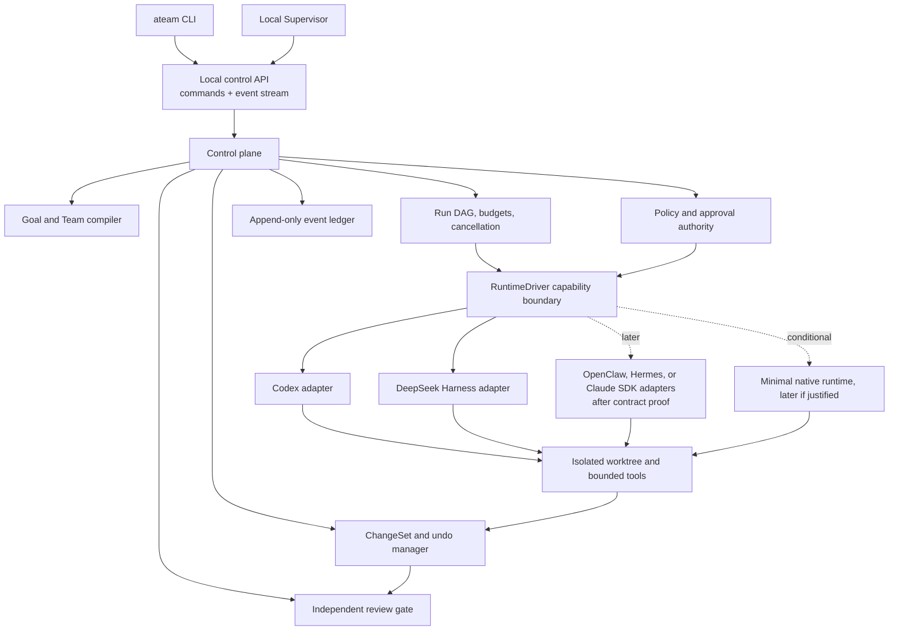
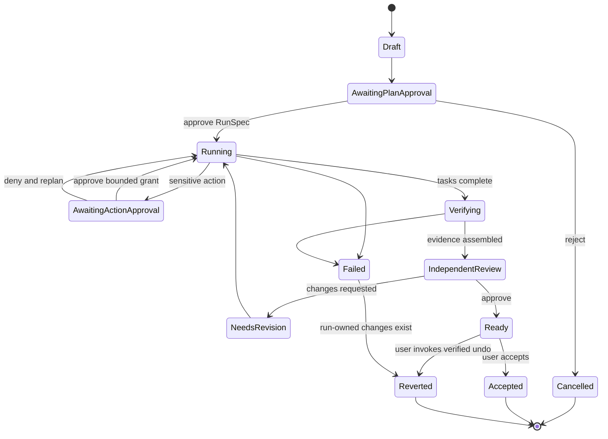

# ATeam Code control plane and Supervisor architecture

Status: Proposed — research design, not an implemented or validated system.

## Decision summary

ATeam Code should be a local-first control plane with two clients over one
canonical run protocol:

- `ateam`, a fast CLI for starting, steering, and inspecting work; and
- Supervisor, a local visual application for plans, live runs, approvals,
  evidence, diffs, review, history, and undo.

Execution runtimes are replaceable drivers. They do not own ATeam Code's
canonical run, policy, evidence, or change record. AGI Super Team remains the
source of Team, Agent, Skill, routing, and Governor definitions.

## Product architecture

## Canonical domain model

The first implementation should keep the model small and versioned:

- `Project`: repository identity, base revision, workspace state, and policy
  profile.
- `RunSpec`: goal, scope, non-goals, team, budgets, grants, and verification
  plan approved by the user.
- `Task`: one DAG node with an owner, dependencies, inputs, outputs, and stop
  conditions.
- `Actor`: user, CEO/coordinator, specialist agent, Governor, runtime, or tool.
- `EventEnvelope`: ordered event with run, task, actor, causation, schema
  version, redaction state, and artifact references.
- `Approval`: requested authority, rationale, decision, duration, and exact
  scope. Approval is not inferred from a successful tool result.
- `Artifact`: content-addressed plan, patch, log excerpt, test result, review,
  or receipt.
- `ChangeSet`: run-owned preimage hashes, patch, file set, declared side
  effects, and undo status.
- `GovernorReceipt`: reviewed artifact hashes, findings, decision, and residual
  risk.

Vendor events are translated into the canonical model. Raw vendor payloads are
not canonical state and are not retained by default.

## Run lifecycle

Each transition emits an event before a client renders the new state. A client
reconnect rebuilds its view from a snapshot plus later events rather than from
terminal output.

## Client protocol

The local API should expose commands and typed events, not a remote shell:

- commands: create project, draft run, approve plan, steer, approve or deny an
  action, cancel, retry a safe task, request review, accept, and undo;
- queries: projects, runs, tasks, actors, approvals, artifacts, diffs, tests,
  usage, and receipts; and
- events: run/task lifecycle, agent message summary, tool request/result,
  approval request/resolution, file change, test result, cost/usage update,
  finding, warning, and terminal state.

Use a local Unix socket where available and a loopback HTTP/WebSocket fallback.
Remote access, accounts, shared organizations, and cloud execution are not v0
requirements. No API should expose credentials or an unrestricted host PTY.

## Runtime driver contract

Every driver must declare capabilities before a run:

- resume, fork, interrupt, steer, and compact;
- structured tool and file-change events;
- command, filesystem, and network approval interception;
- child-agent visibility and cancellation;
- usage reporting and stable session identity; and
- sandbox and execution-environment guarantees.

The control plane fails closed when the approved RunSpec requires a missing
capability. It must not silently switch drivers mid-run.

## Safety boundaries

- Planning is read-only. Writes begin only after the user approves a RunSpec.
- Filesystem, shell, network, credentials, MCP, git publication, deployment,
  and other external effects are separate grants.
- Work occurs in an isolated worktree or is rejected when pre-existing user
  changes cannot be preserved.
- All child processes and child agents belong to the run cancellation scope.
- Repository text, model output, tool output, Skills, and plugins are untrusted
  input, never policy authority.
- Unknown external side effects are surfaced for human resolution and are not
  retried automatically.
- Independent review is read-only and receives the exact artifact hashes it
  evaluates.
- Undo applies only to run-owned changes after verifying their preimages; it
  never resets unrelated user work.

## Storage

Use a small local database for indexed run state and a content-addressed
artifact directory for larger payloads. Append events transactionally before
publishing them to clients. Encrypt or omit sensitive artifacts, redact before
model or reviewer access, and define retention by artifact class. A database
is an implementation choice, not permission to collect full prompts or raw
tool output indefinitely.

## Delivery slices

### Slice 0: evidence prototype

- One repository, one user, one local machine.
- CLI creates a RunSpec and drives one Codex adapter.
- Event ledger, plan approval, diff, test receipt, detached Governor review,
  cancellation, and run-owned undo.
- A single-agent baseline and a small adversarial safety suite.

### Slice 1: useful visual Supervisor

- Project/run list, Plan, Live Run, Approval Center, Review, and History views.
- Reconnect and replay from canonical events.
- Cost, token, elapsed-time, and context-pressure indicators.
- Keyboard-complete approval and navigation flows.

### Slice 2: runtime neutrality and team value

- A pinned DeepSeek Harness adapter passes the same conformance suite.
- AGI Super Team manifests compile into minimal role/task DAGs.
- Measured routing decides whether a task stays single-agent or becomes a
  team run.

### Conditional slice: native runtime

Build a native loop only if adapter evidence shows that required policy,
events, providers, cancellation, or scheduling cannot be implemented safely
through drivers. It must pass the same conformance suite before becoming a
default.

## Validation gates

The architecture is not accepted until tests demonstrate:

- no unapproved write, network use, credential access, commit, push, or deploy
  in the defined adversarial suite;
- complete request-to-policy-to-approval-to-result traceability;
- cancellation without orphan processes;
- recovery after client reconnect and injected runtime failure;
- undo that preserves pre-existing user changes;
- the same representative task through two drivers; and
- a multi-agent cohort that beats a capable single-agent baseline on accepted
  change rate or human rework without unacceptable cost and latency.
